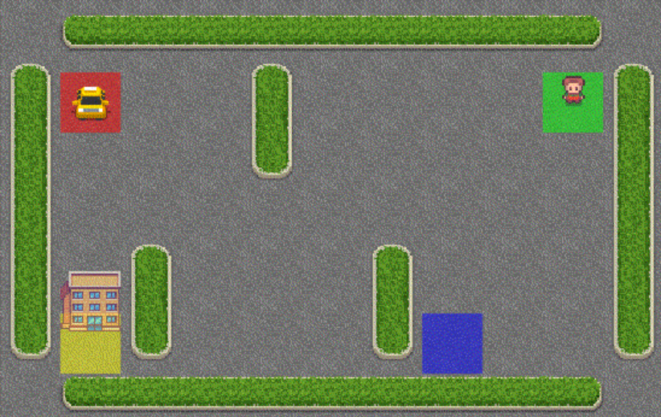

# CS6700: Reinforcement Learning Programming Assignment 3
By Shreya .S. Ramanujam (EE21B126) and Srikar Babu Gadipudi (EE21B138)

We present a set of experiments by performing SMDP Q Learning and Intra Option Q Learning on the "Taxi-v3" environment.

- The report can be found - [here](Report.pdf).
- The code for these experiments can be found - [here](code_final.ipynb).
- The reward plots - [here](Reward_Plots).
- The environment rendering figures - [here](Rendering_Figures).
- The figures visualizing the Q values - [here](Visualizing_Q_values).
